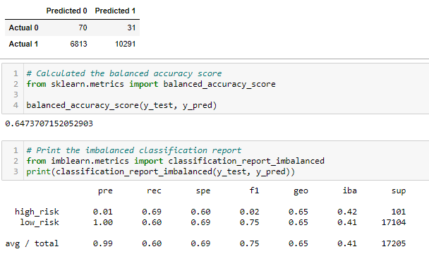
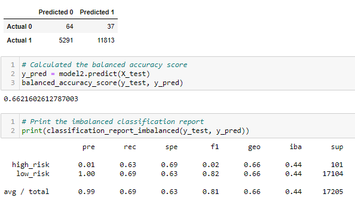
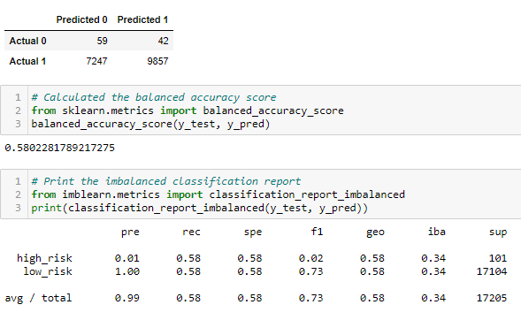
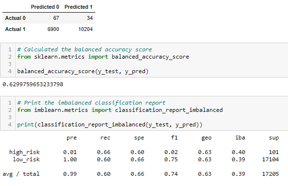
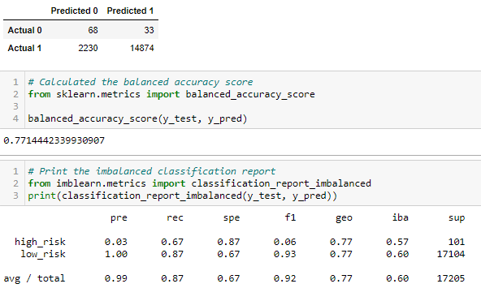
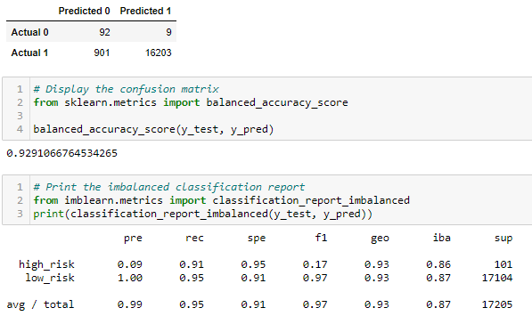
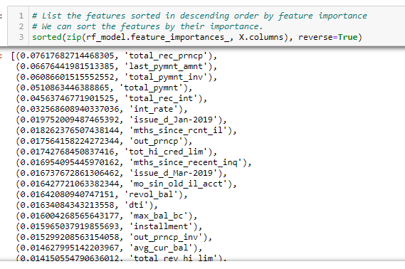

# Credit_Risk_Analysis
#### 17 Machine Learning Challenge

## Overview of Credit Risk Analysis:

I have been working with Jill to build skills in data preparation, statistical reasoning, and machine learning having to do with credit risk. This is because in 2019, 
more than 19 million Americans had at least one unsecured personal loan.  Personal lending is growing fast, even more than credit card, 
auto, mortgage, and student loans. FinTech firms are looking for better methods than traditional loan processes. I have decided 
to use the latest machine learning techniques, so I can continuously analyze large amounts of data and predict trends to optimize lending having to
so with lower over-all credit card risk.

As good loans easily outnumber risky loans credit risk is an inherently unbalanced classification problem. Therefore, I employed different techniques 
to train and evaluate models with unbalanced classes. I used imbalanced-learn and scikit-learn libraries to build and evaluate models using resampling.

Using the credit card credit dataset from LendingClub, a peer-to-peer lending services company, I oversample the data using the RandomOverSampler 
and SMOTE algorithms, and undersample the data using the ClusterCentroids algorithm. Then, I used a combinatorial approach of over and under sampling 
using the SMOTEENN algorithm. Finally, I compared the two new machine learning models that reduce bias, BalancedRandomForestClassifier and EasyEnsembleClassifier, 
to predict credit risk. 

## Results of : 

* The first method used was the Naive Randond Oversampling method and this was the results:

The calculation of the balanced accuracy is reflecting the relatively high number of false postives, 
precision showed that high_risk was very low so they would miss out on potentional clients as well approved where they shouold not have (poor precision)
the and recall while in the 60% is not very impressive.  Overall this model was not very good.

* The second method used was the SMOTE Oversampling method calculation. The balanced accuracy was similar to the above in that they would loose out 
on many prospective clients and also, with the high rate of false positive approved credit where they should not have (bad precision on the high-risk).
The recall is almost the same as above in the %60s, this could be improved. 

* The third method used was the Undersampling method for the calculations. The numbers are going in the wrong direction as the false postives are very high
approving credit when it should not have been, thus recall numnbers are going into the %50s.  While the low risk precision looks good, again the problem is more with \
the inaccuracy of the high-risk.

* The forth method used was was the Combination (Over and Under) Sampling method for the calculation. 
This is very similar to the above 3 methods. Once again the recall numbers are not impressive due to the lost chance of making loans to qualified customers
which would be last revenue.  The actual loans made are very small and again approved where should not have.  The recall numbers are in the %60s - not at
all impressive.
 

* The fifth method used to calculate was the Balanced Random Forest Classifier. We see a slight imporvement in precision on this method regarding the high-risk accuracy but
again only up from %1 to %3, over all poor calculation.  While the balanced accuracy is %77, this could definitely be imporved. Again we are seeing the biggest problem for
recall and the f1 score having to do with the high-risk.

* The 6th method used was the Easy Ensemble AdaBoost method. The balanced accuracy moved up to %93 as they were able to get the approved credit up and also
those that should not have been approved down, substantially - so recall is looking better. The F1 score is still low for the high-risk, so there is some improvement
required there.

## Final Results
Many of the models had similar output and we did not see much difference in overall statistics, except for the Easy Ensemble AdaBoost method which produced better statistics.
Additional analalys on over fiitting is required as their was too much data in the 85 columns.  Many of the columns had similar or multicollinearity data
 in which one feature or predictor in the regression model are too correlated with the others. We should look at removing many of the columns based on the below shown
features by their importance snapshot. It will take some time to go through and understand each column but better results are sure to be found.

